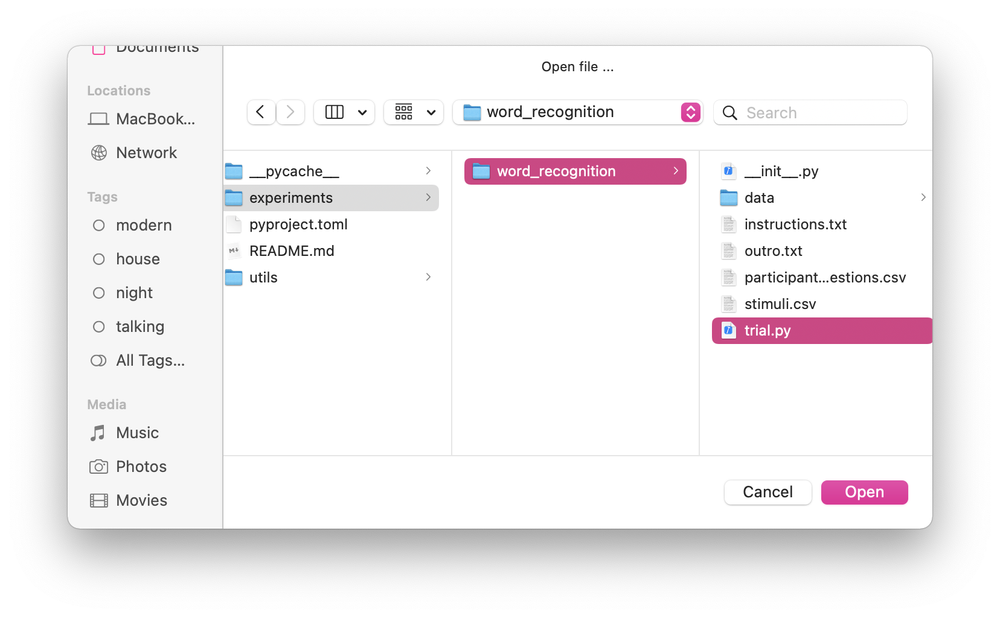
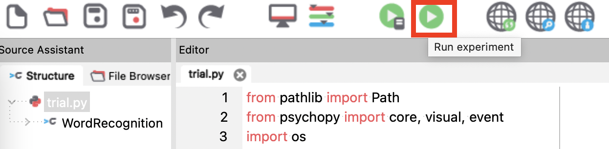
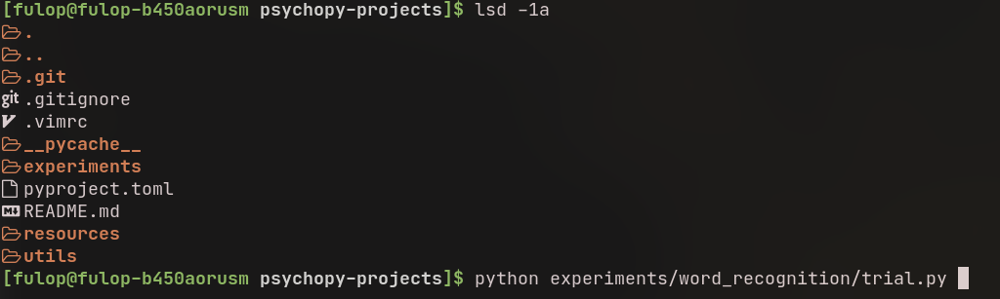

# [Work in Progress] Experiments Created With `psychopy`

This repo will contain a bundle of experiments created with [`psychopy`](https://www.psychopy.org/). Feel free to fork/modify it.

## Motivation behind this project
When I got started with `psychopy`, it was challenging to find good examples that used only Python (and not the builder) for creating experiments with this framework.

This repo attempts to fill this gap, aimed at more advanced scientists/student who are confident at coding with Python, but would like to see some examples before reading the full documentation of `psychopy`.

## How to run the experiments?

1. Make sure that you have installed `psychopy`
  - [installation page](https://www.psychopy.org/download.html)
  > **WARNING**: Based on my experience, if you want to use `psychopy` from the command line, you have to install the `psychopy` package with `pip`, regardless of the OS.

2. Download the contents of this repository
  - from [here](release-link)
  - or simply clone the repository with `git`.

3. Choose an experiment from the `experiments` directory (e.g.: _word_recognition_) and run the `trial.py` file with either:
  - the `PsychoPy` desktop app
    - Open the experiment:
  
    - Open experiment in MacOS:
  
  - or the terminal:
  

To see sample outputs for the experiment, check the contents of the `sample-data` directory next to the `trial.py` file. You can find more information about the experiment in the `README.md` file in the experiment's directory.

## Experiments:
> More experiments will be added in the future.

- _word-recognition_: Participants must decide if the words presented to them are fake or not. ([more info](./experiments/word_recognition/))
